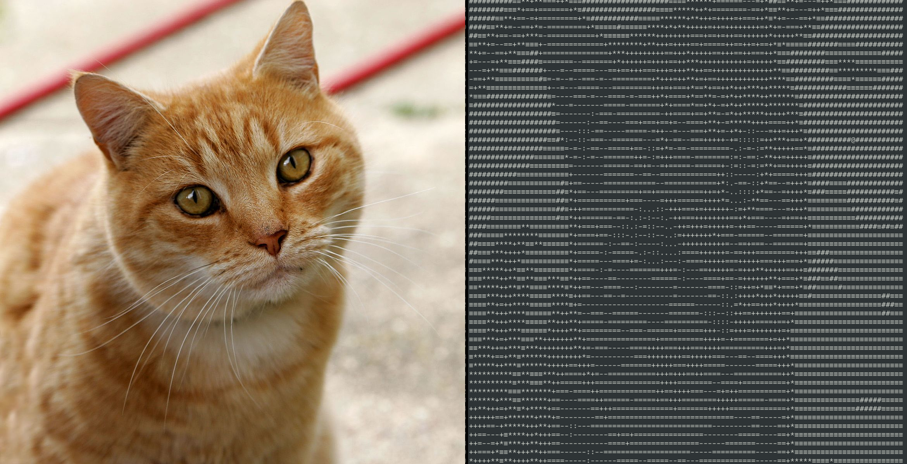

# Image to ASCII Art


This project is a portfolio project that aims to convert images into ASCII art using Python.


## Installation

To use this project, follow these steps:

1. Clone the repository: `git clone https://github.com/sasinhe/image-to-ascii-art.git`
2. Install the required dependencies: `pip install -r requirements.txt`

## Usage

To convert an image to ASCII art, run the following command:

```
python convert.py --image path/to/image.jpg
```

Make sure to replace `path/to/image.jpg` with the actual path to your image file.

## Examples



Feel free to experiment with different images and settings to create your own ASCII art masterpieces!
